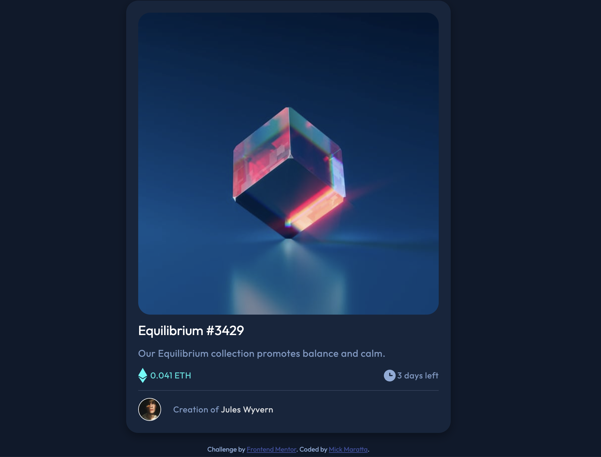

# Frontend Mentor - NFT preview card component solution

This is a solution to the [NFT preview card component challenge on Frontend Mentor](https://www.frontendmentor.io/challenges/nft-preview-card-component-SbdUL_w0U). Frontend Mentor challenges help you improve your coding skills by building realistic projects. 

## Table of contents

- [Frontend Mentor - NFT preview card component solution](#frontend-mentor---nft-preview-card-component-solution)
  - [Table of contents](#table-of-contents)
  - [Overview](#overview)
    - [The challenge](#the-challenge)
    - [Screenshot](#screenshot)
    - [Links](#links)
  - [My process](#my-process)
    - [Built with](#built-with)
    - [What I learned](#what-i-learned)
    - [Useful resources](#useful-resources)
  - [Author](#author)

**Note: Delete this note and update the table of contents based on what sections you keep.**

## Overview

### The challenge

Users should be able to:

- View the optimal layout depending on their device's screen size
- See hover states for interactive elements

### Screenshot



### Links

- Solution URL: [https://github.com/mickmaratta/nft-preview-card-component-main](https://github.com/mickmaratta/nft-preview-card-component-main)
- Live Site URL: [https://mickmaratta.github.io/nft-preview-card-component-main/](https://mickmaratta.github.io/nft-preview-card-component-main/)

## My process

### Built with

- Semantic HTML5 markup
- CSS custom properties
- Flexbox
- Mobile-first workflow

### What I learned

How to make an image overlay effect.

```html
<div class="img-section">
    
    <div class="overlay">
      
    </div>
</div>
```
```css
#equilibrium {
  width: 100%;
  border-radius: 20px;
}

.img-section {
  display: inline;
  position: relative;
  align-items: center;
  justify-content: center;
  overflow: hidden;
  border-radius: 20px;
}
    
.overlay {
  position: absolute;
  display: flex;
  justify-content: center;
  height: 100%;
  width: 100%;
  top: 0;
  left: 0;
  background-color: hsla(178, 100%, 50%, 0.4);
  opacity: 0;
  z-index: 99;
  transition: opacity 0.35s;
}
    
.icon {
  opacity: 0;
  width: 20%;
  object-fit: contain;
  object-position: center;
}

.overlay:hover, .icon {
  opacity: 1;
  cursor: pointer;
}
```

### Useful resources

- [Image Overlay - W3 Schools](https://www.w3schools.com/howto/howto_css_image_overlay_title.asp) - This helped me to creat an image overlay effect.

## Author

- Website - [Mick Maratta](https://mickmaratta.github.io/)
- Frontend Mentor - [@mickmaratta](https://www.frontendmentor.io/profile/mickmaratta)
